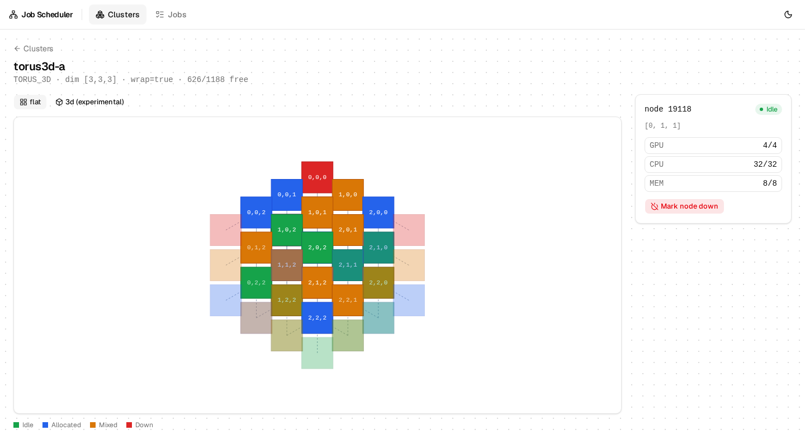
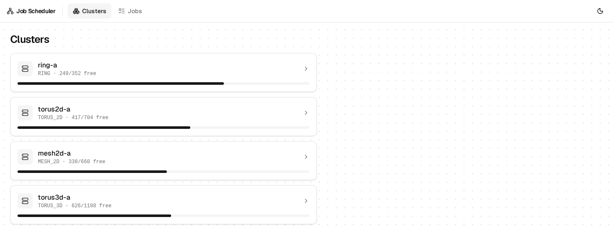
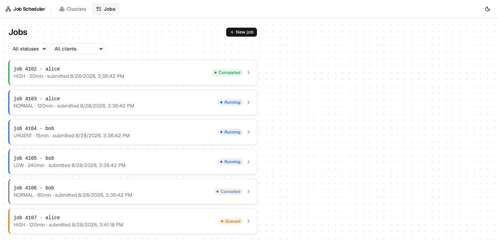
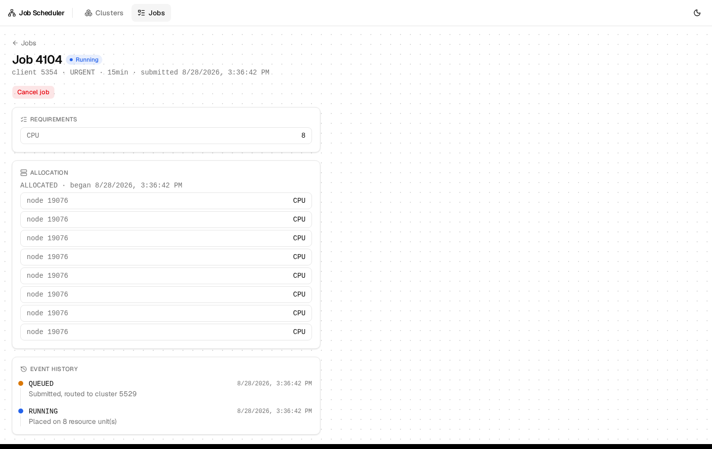
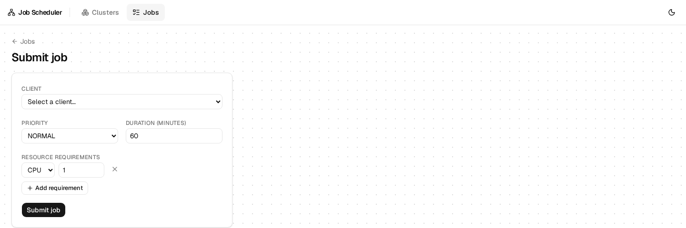
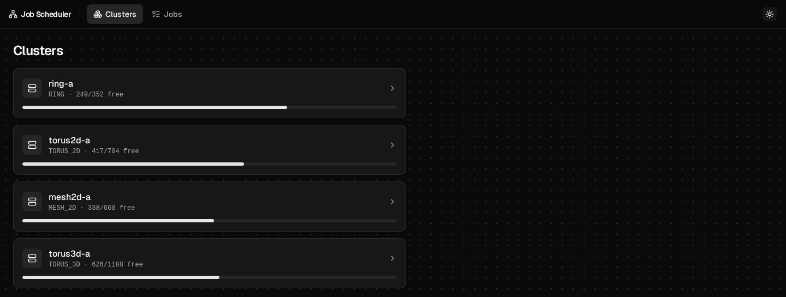

# Job Scheduler

A job scheduling and placement system: a client submits a job, a scheduler orders the queue, a placer assigns the job to a node, and the resulting allocation is tracked in a database.

Built with **FastAPI** (backend, `backend/`) and **React** (frontend, `frontend/`). Design history lives in issues #25–#27.

<p align="center">
  
</p>

## Features

- **Cluster topology visualization** — ring, mesh, and torus layouts rendered live, with per-node resource usage and a click-through detail panel.
- **Job lifecycle management** — submit jobs with multi-resource requirements, track them through `QUEUED` → `RUNNING` → `COMPLETED`/`CANCELLED`, and inspect the full event history and allocation for each one.
- **Light & dark mode**, throughout.

| Clusters | Jobs |
|---|---|
|  |  |

| Job detail | Submit a job |
|---|---|
|  |  |

<p align="center">
  
</p>

## Getting started

### Backend

```bash
cd backend
python3 -m venv .venv
.venv/bin/pip install -r requirements.txt
.venv/bin/alembic upgrade head
.venv/bin/uvicorn app.main:app --reload
```

Requires a `.env` with `DATABASE_HOSTNAME`/`DATABASE_PORT`/`DATABASE_USERNAME`/`DATABASE_PASSWORD`/`DATABASE_NAME`, and Postgres running against those settings. `backend/app/config.py` looks for it at the repo root or in `backend/`, whichever exists.

Tests (from `backend/`): `.venv/bin/pytest -v`.

### Frontend

A pnpm workspace at the repo root; the app lives in `frontend/`.

```bash
pnpm install
pnpm generate:api   # regenerate the typed API client from the backend's current OpenAPI schema
pnpm --filter frontend dev
```

The backend must be running (see above) for `generate:api` and for the app to actually load data. Vite serves on `http://localhost:5173`; the backend's CORS config (`backend/app/main.py`) allows that origin.

Frontend tests: `pnpm --filter frontend test`.

## Documentation

- [docs/architecture.md](docs/architecture.md) — class diagram and how the pieces (`Client`, `Server`, `Scheduler`, `Placer`, `Topology`, `Allocation`, ...) fit together.
- [docs/erd.md](docs/erd.md) — database schema backing persistence.
- [docs/decisions.md](docs/decisions.md) — assumptions and modeling decisions behind both of the above, plus open items.
