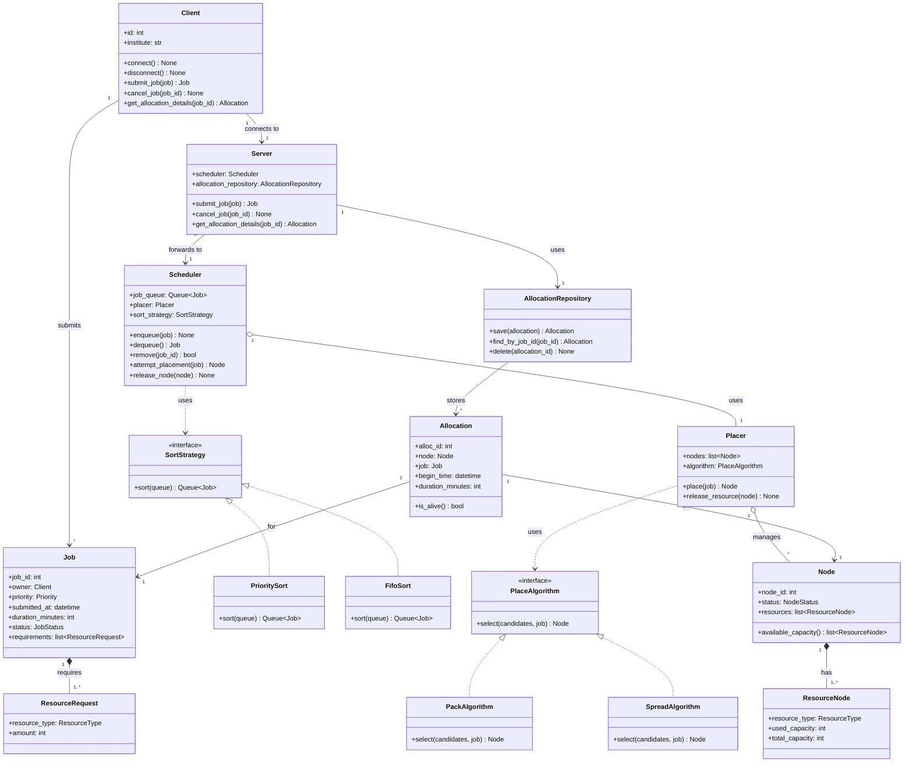

# Workload Management System

A from-scratch workload management system: a client submits a job, a scheduler orders the queue, a placer assigns the job to a node, and the resulting allocation is tracked in a database.

Built with **FastAPI** (backend) and **TypeScript** (frontend). Design history lives in issues #25–#27.

## Status

Design phase. Class diagram below is the current agreed shape; implementation scaffolding is starting in `backend/` and `frontend/`.

## Class diagram

## How the pieces fit together

- **`Client`** builds a `Job` itself and calls `submit_job(job)` / `cancel_job(job_id)` / `get_allocation_details(job_id)` — three explicit commands rather than one generic entry point, so dispatch is just normal method resolution, no internal type-switch.
- **`Server`** is the boundary: it's the only thing a `Client` talks to. It assigns `job_id`/`owner` on receipt (so a client can't forge either), forwards jobs to `Scheduler`, and is the only class that reads/writes `AllocationRepository`.
- **`Scheduler`** only decides *when* a job gets handled: it orders the queue (`SortStrategy` — `PrioritySort` or `FifoSort`, swappable), and calls `Placer` to attempt placement. It doesn't build or store allocations.
- **`Placer`** only decides *where*: it filters candidate `Node`s and delegates the actual pick to a `PlaceAlgorithm` (`PackAlgorithm` or `SpreadAlgorithm`, swappable). It returns a `Node`, not an `Allocation`.
- **`Allocation`** is where the request side (`Job`) and the resource side (`Node`) meet. It's built by `Server` after a successful placement and persisted through `AllocationRepository`, backed by the database described in the issue #27 ER diagram.

## Open design questions

- **REST vs. WebSocket:** `Client.connect()`/`disconnect()` assume a persistent session. Plain REST has no connect step — identity comes from the request itself. Keep them only if live job/allocation status pushes are wanted.

## Layout

- `backend/` — FastAPI service
- `frontend/` — TypeScript client
