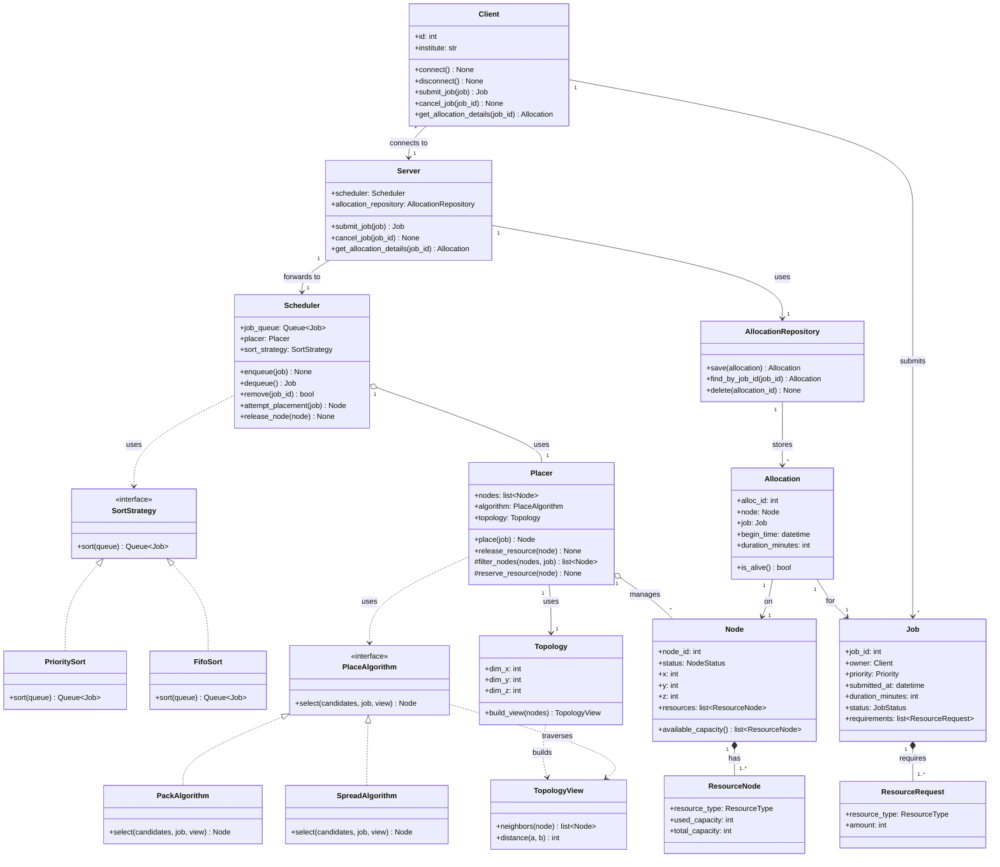
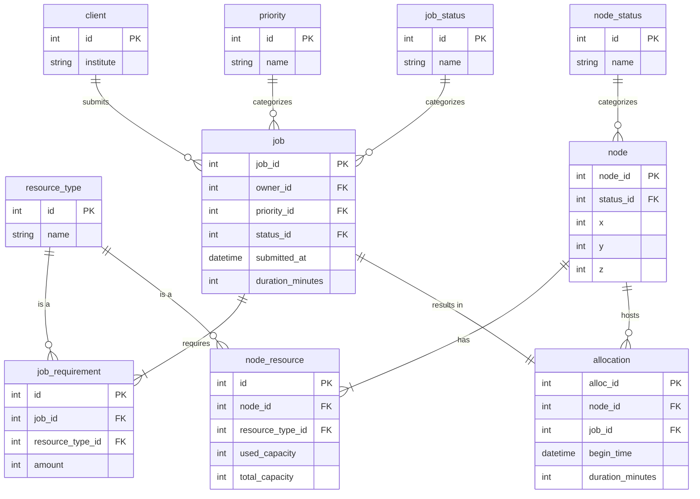

# Job Scheduler

A from-scratch job scheduling and placement system: a client submits a job, a scheduler orders the queue, a placer assigns the job to a node, and the resulting allocation is tracked in a database.

Built with **FastAPI** (backend) and **TypeScript** (frontend). Design history lives in issues #25–#27.

## Status

Design phase. Class diagram below is the current agreed shape; implementation scaffolding is starting in `backend/` and `frontend/`.

## Class diagram

## How the pieces fit together

- **`Client`** builds a `Job` itself and calls `submit_job(job)` / `cancel_job(job_id)` / `get_allocation_details(job_id)` — currently maintained commands.
- **`Server`** is the boundary: it's the only thing a `Client` talks to. It assigns `job_id`/`owner` on receipt (so a client can't forge either), forwards jobs to `Scheduler`, and is the only class that reads/writes `AllocationRepository`.
- **`Scheduler`** only decides *when* a job gets handled: it orders the queue (`SortStrategy` — `PrioritySort` or `FifoSort`, swappable), and calls `Placer` to attempt placement. It doesn't build or store allocations.
- **`Placer`** only decides *where*: it filters candidate `Node`s and delegates the actual pick to a `PlaceAlgorithm` (`PackAlgorithm` or `SpreadAlgorithm`, swappable). It returns on which allocated `Node`.
- **`Allocation`** is where the request side (`Job`) and the resource side (`Node`) meet. It's built by `Server` after a successful placement and persisted through `AllocationRepository`, backed by the database described in the issue #27 ER diagram.

### Where vs. when

The two classes that make an allocation happen are split by exactly one question each:

- **`Scheduler` answers *when*.** Given the queue, whose turn is it? That's ordering — `SortStrategy` (`PrioritySort` or `FifoSort`) decides, and it's swappable independently of everything else.
- **`Placer` answers *where*.** Given a job whose turn has come, which node fits it? That's placement — `PlaceAlgorithm` (`PackAlgorithm` or `SpreadAlgorithm`) decides, also swappable independently.

Neither one needs to know how the other makes its decision — `Scheduler` just calls `Placer.place(job)` once a job reaches the front of the queue.

### Topology

Nodes sit on a 3D torus: each `Node` has a fixed `(x, y, z)` coordinate. `Topology` holds the grid dimensions and, given the current node population, builds a `TopologyView` — a fresh, disposable snapshot with `neighbors(node)` and `distance(a, b)` that a `PlaceAlgorithm` traverses to make its pick.

The reason it's split into `Topology` + `TopologyView` rather than one object: `Pack`/`Spread` need to reason about occupancy — "which free candidate is closest to an already-`OCCUPIED` node" — and occupied nodes never appear in `candidates` (they failed the resource-fit filter). Only `Placer` has the full node list, so `Placer` is the one holding `topology` and calling `topology.build_view(self.nodes)` before every placement attempt; `PlaceAlgorithm.select(candidates, job, view)` then traverses that view without needing any state of its own.

- **`PackAlgorithm`** walks `view` from the candidates toward the nearest `OCCUPIED` node and picks the closest — consolidates usage, keeps free space contiguous.
- **`SpreadAlgorithm`** does the same walk and picks the farthest — fault-isolates.

Grid dimensions (`dim_x/y/z`) are config, not a database table — there's only one cluster, so a `topology` table would imply rows we don't have.

## Database schema

The ER diagram backing `AllocationRepository` (and the rest of the persisted state), tracked in issue #27. `priority`, `job_status`, `node_status`, and `resource_type` are lookup tables — the relational equivalent of the enums in the class diagram above.

Three corrections from the original issue #27 diagram: `node_resource.node_id` is the FK (not `node.resource_node_id`), so one node can carry several resource rows; `duration_minutes` is an `int`, not a `timestamp` — a duration is a length, not a point in time; and `allocation` no longer carries `client_id` — the owner is reachable through `job.owner_id`.

