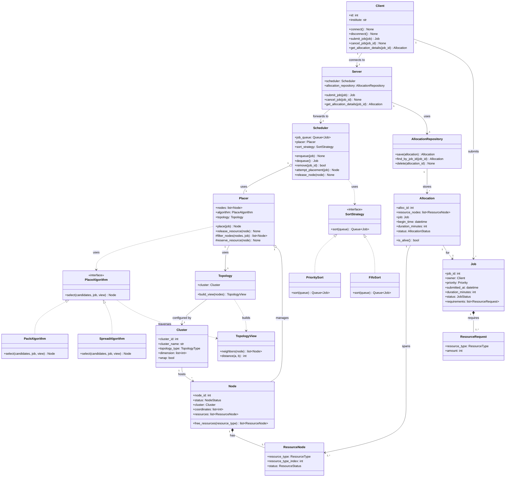

# Architecture

Design history lives in issues [#25](https://github.com/taroryu004-lab/job-scheduler/issues/25)–[#27](https://github.com/taroryu004-lab/job-scheduler/issues/27). This is the current agreed shape.

## Class diagram

## How the pieces fit together

- **`Client`** builds a `Job` itself and calls `submit_job(job)` / `cancel_job(job_id)` / `get_allocation_details(job_id)` — currently maintained commands.
- **`Server`** is the boundary: it's the only thing a `Client` talks to. It assigns `job_id`/`owner` on receipt (so a client can't forge either), forwards jobs to `Scheduler`, and is the only class that reads/writes `AllocationRepository`.
- **`Scheduler`** only decides *when* a job gets handled: it orders the queue (`SortStrategy` — `PrioritySort` or `FifoSort`, swappable), and calls `Placer` to attempt placement. It doesn't build or store allocations.
- **`Placer`** only decides *where*: it filters candidate `Node`s and delegates the actual pick to a `PlaceAlgorithm` (`PackAlgorithm` or `SpreadAlgorithm`, swappable). It returns which node's `ResourceNode` units get consumed.
- **`Allocation`** is where the request side (`Job`) and the resource side (`ResourceNode`) meet — it holds the specific `ResourceNode` units consumed, not a single `Node`, since one allocation can span several resource units (or several nodes). It's built by `Server` after a successful placement and persisted through `AllocationRepository`, backed by the database described in [docs/erd.md](erd.md).

### Where vs. when

The two classes that make an allocation happen are split by exactly one question each:

- **`Scheduler` answers *when*.** Given the queue, whose turn is it? That's ordering — `SortStrategy` (`PrioritySort` or `FifoSort`) decides, and it's swappable independently of everything else.
- **`Placer` answers *where*.** Given a job whose turn has come, which node fits it? That's placement — `PlaceAlgorithm` (`PackAlgorithm` or `SpreadAlgorithm`) decides, also swappable independently.

Neither one needs to know how the other makes its decision — `Scheduler` just calls `Placer.place(job)` once a job reaches the front of the queue.

### Topology

A `Node` belongs to exactly one `Cluster`, and its position is a `coordinates` vector rather than a fixed `(x, y, z)` — the vector's length matches the cluster's dimensionality. `Cluster` carries `topology_type` (e.g. `TORUS`, `MESH`, `TREE`, `FLAT` — see [docs/erd.md](erd.md)), `dimension` (the size of each axis, so `[8, 8, 8]` describes what used to be the only supported shape: a fixed 3D torus), and `wrap` (whether coordinates wrap at each axis's boundary — `wrap=true` is what makes a topology a torus instead of a plain grid). `Topology` is the runtime object built from a `Cluster`'s config; given the current node population, it builds a `TopologyView` — a fresh, disposable snapshot with `neighbors(node)` and `distance(a, b)` that a `PlaceAlgorithm` traverses to make its pick.

The reason it's split into `Topology` + `TopologyView` rather than one object: `Pack`/`Spread` need to reason about occupancy — "which free candidate is closest to an already-`OCCUPIED` node" — and occupied nodes never appear in `candidates` (they failed the resource-fit filter). Only `Placer` has the full node list, so `Placer` is the one holding `topology` and calling `topology.build_view(self.nodes)` before every placement attempt; `PlaceAlgorithm.select(candidates, job, view)` then traverses that view without needing any state of its own.

- **`PackAlgorithm`** walks `view` from the candidates toward the nearest `OCCUPIED` node and picks the closest, consolidates usage, keeps free space contiguous.
- **`SpreadAlgorithm`** does the same walk and picks the farthest.

Both algorithms rely on `neighbors`/`distance` being defined generically over `coordinates`, `dimension`, and `wrap` rather than hardcoded 3D math — that's what makes them work unchanged whether the cluster is a torus, a mesh, or something else. Grid dimensions used to be fixed config with a single implied cluster; now they're data on `Cluster`, and more than one cluster (each with its own topology) is representable.

**Resolved (issue #27, 2026-08-01 "final agreed on version"):** the `Cluster` entity proposed on 2026-07-29 is now designed — see [docs/erd.md](erd.md) and [docs/decisions.md](decisions.md) for what it looks like and what's still open (e.g. whether one `Placer` handles multiple clusters or there's one `Placer` per cluster).
