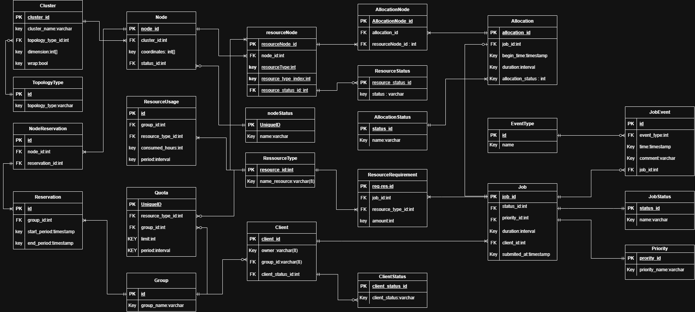
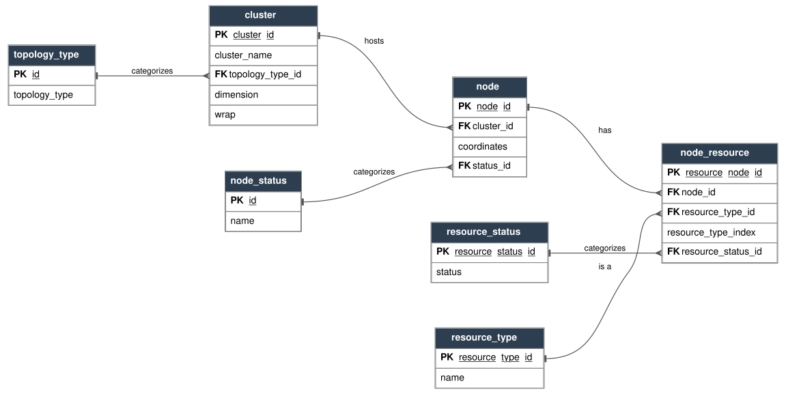
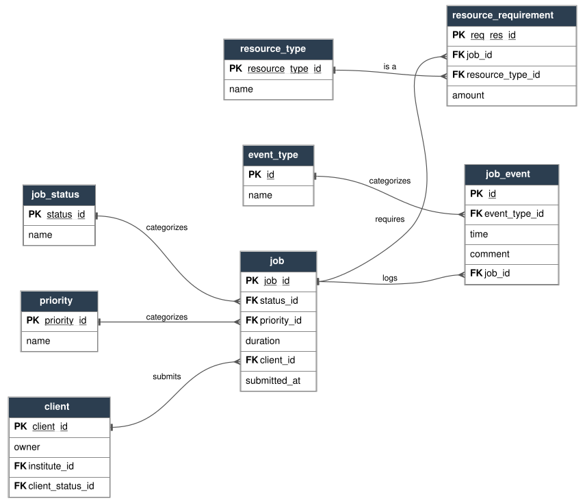
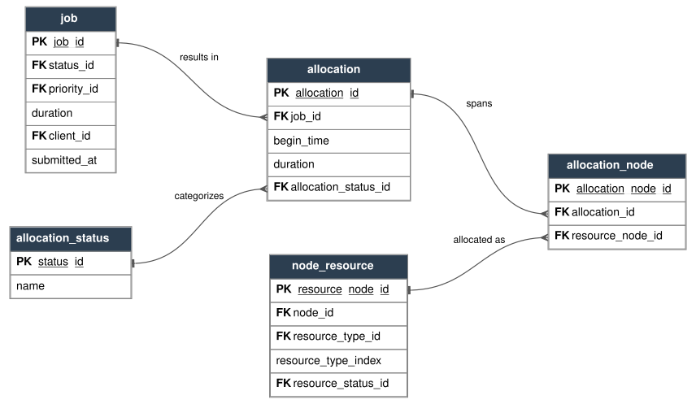
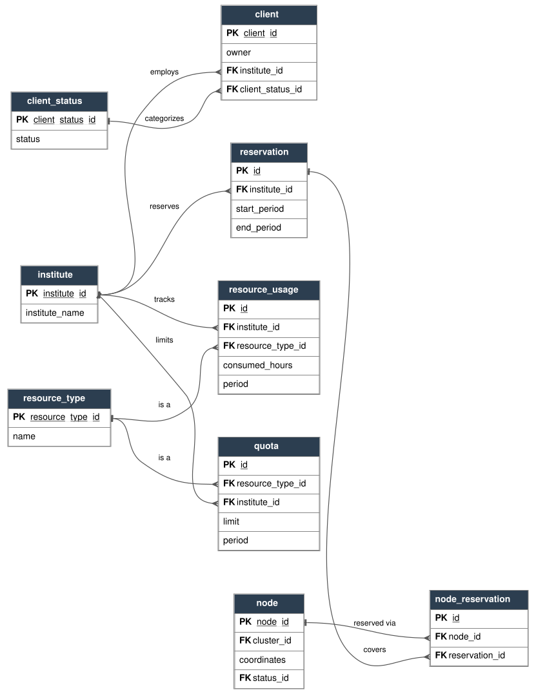

# Database schema (ERD)

Tracked in issue [#27](https://github.com/taroryu004-lab/job-scheduler/issues/27), reflecting the 2026-08-01 comment marked "the final agreed on version." The whole system is below as one diagram, followed by the same schema split into four subsystem views for actually reading — some tables (`node`, `client`, `job`, `node_resource`) appear in more than one subsystem view because they're the join points between subsystems.

`node_status`, `resource_status`, `resource_type`, `client_status`, `job_status`, `allocation_status`, `priority`, `event_type`, and `topology_type` are lookup tables — the relational equivalent of the enums in the [class diagram](architecture.md).

## Full schema (whole system)

The whiteboard diagram from the #27 comment, as posted.

## Subsystem views

The same schema, redrawn per subsystem for actually reading — rendered with Graphviz instead of Mermaid so each relationship line connects to the exact PK/FK field it references, rather than just to the table as a whole. Source: [docs/diagrams/gen_erd.py](diagrams/gen_erd.py) — edit the `ENTITIES`/`RELATIONSHIPS`/`SUBSYSTEMS` data there and re-run it (`python3 docs/diagrams/gen_erd.py`) to regenerate all four SVGs after a schema change. Click any image to open the full-size SVG.

### Topology & compute resources

### Jobs

### Allocation

### Clients & organizational limits

## What changed from the original #27 diagram, and why

- **`node` no longer has fixed `x`/`y`/`z` columns — it has `coordinates` (a variable-length int array) and a `cluster_id` FK.** A 3D torus was one specific case; the reviewed design generalizes to any topology shape by moving the dimensionality and wraparound behavior onto `cluster`.
- **New `cluster` and `topology_type` entities.** `topology_type` is a lookup table (e.g. `TORUS`, `MESH`, `TREE`, `FLAT`); `cluster` picks one via `topology_type_id` and carries `dimension` (an int array — its length is the number of axes, each entry is that axis's size) and `wrap` (whether coordinates wrap at each axis's boundary — `true` is what made the old design a torus instead of a plain grid).
- **`allocation` no longer points at `node` directly — it goes through `allocation_node` → `node_resource`.** An allocation can span more than one physical resource unit (e.g. several GPUs across a node, or several nodes), so the join table (`allocation_node`) is the many-to-many between one `allocation` and the specific `node_resource` rows it consumed.
- **`node_resource` tracks status per resource unit (`resource_status_id`, `resource_type_index`), not `used_capacity`/`total_capacity` counters.** Each physical unit (CPU core, GPU, etc.) gets its own row with its own status, so "which exact unit got allocated" is answerable directly instead of being inferred from a counter. `resource_type_index` disambiguates units of the *same* `resource_type` on the *same* node — e.g. `(node_id=5, resource_type=GPU, resource_type_index=2)` is "the 3rd GPU on node 5." It's scoped per `(node, resource_type)`, not globally unique, and carries no meaning beyond that (not a physical slot/PCIe-lane number or anything hardware-specific). Enforced by a DB-level `UniqueConstraint` on `(node_id, resource_type, resource_type_index)` (`uq_node_resource_type_index`) — nothing in the domain layer actually reads this field today (allocation is tracked via `resource_node_id`, the real primary key, not this index), but the constraint stops it from silently becoming meaningless.
- **`resource_requirement` (job → resource_type + amount) is separate from `allocation_node` (what actually got allocated).** Keeping both means the request and the fulfillment are separate, auditable facts.
- **The organizational entity is `institute`.** `client` has an `institute` field in the class diagram — the ERD's `Instite` table line up: `client.institute_id`, `quota.institute_id`, `reservation.institute_id`, and `resource_usage.institute_id` all reference `institute`. Quotas, reservations, and usage tracking are institute-level concerns, not per-client ones.
- **`job_event` was added** to answer "what happened and when" for a job (status transitions, placement attempts, cancellations) — `allocation` only reflects current/final placement, not history.

## Corrections carried over from the original README-inline diagram

- `node_resource.node_id` is the FK (not `node.resource_node_id`), so one node can carry several resource rows.
- A duration is stored as an `interval`/length, not a `timestamp` — a duration is a length, not a point in time.
- `allocation` does not carry `client_id` directly — the owner is reachable through `job.client_id`.
